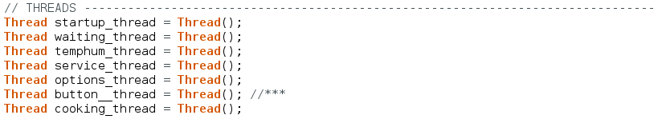
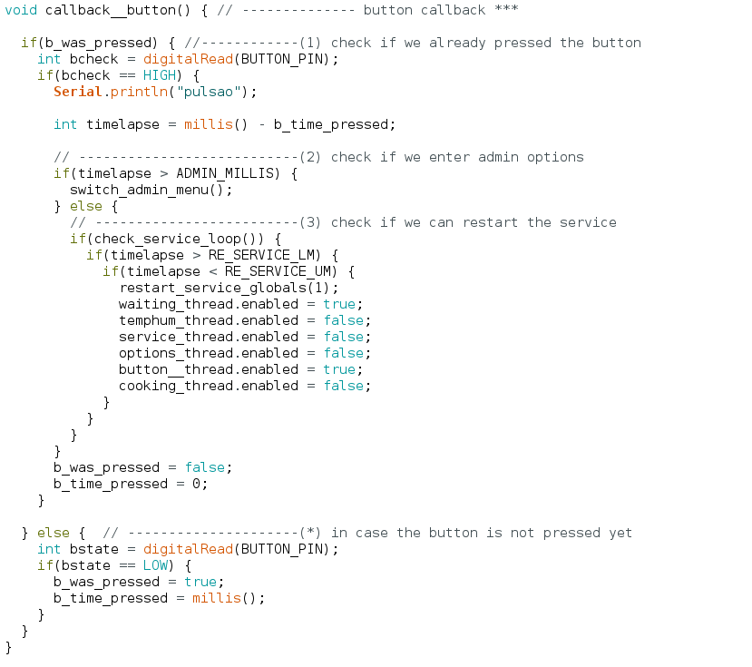
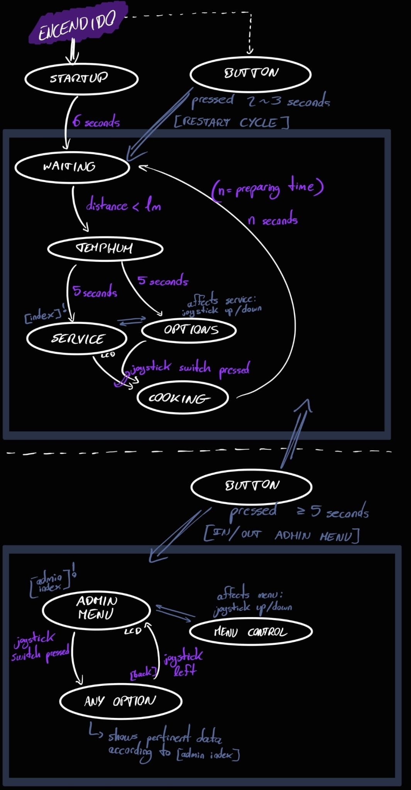

# Practical 3 - Embedded and Real-Time Systems

Developed sections:
* Implementation of the service mode in its entirety, being able to run in a permanent loop
* Correct functioning of the button to restart the service
* Switching to the administrator menu also by means of the button
* Temperature and humidity, second hand and distance options of this menu

---

## TECHNICAL ASPECTS

### Regarding the service mode

To develop the full functionality of the practice I needed to declare and use a total of 10 threads. Of those, 7 belong to the boot control and the service mode that the controller has. The main execution loop does not know what is going on inside each one, it simply checks which ones are available (or active) in each iteration and executes them.

#### ABOUT THREADS:
- They all work by activating and deactivating each other as the controller changes state
- Each thread has its own callback that executes the relevant code and takes care of deactivating it and activating the next ones if necessary
- They have different intervals between them depending on what they are in charge of (the more reactive I have considered they should be, the smaller their interval is and the more iterations per second they will have set)
- The thread corresponding to the button control is ‘invisible’ to the rest, since it remains active from the beginning of the programme but no other thread deactivates or interacts with it at any time. On the other hand, this thread does affect all the others since it controls the restart of the service mode and the change to the administrator menu

Here we can see all the threads used in the start-up functionality (only the first thread) and service:

 
       

However, as we have already mentioned, although it includes here the thread that controls the button press times, it could be said that it belongs to both functionalities (service and administrator menu). The reason it is included here was because of its early implementation

#### ABOUT CALLBACKS:
The following is a brief explanation of what each of the startup and service callbacks do, according to the thread they belong to.
* **Callback startup** - turns the red LED on and off until the initial load time is over. The "LOADING..." message displayed on the lcd is pre-printed in the *setup()* of the driver.
* **Callback waiting** - prints the "WAITING CUSTOMER" message the first time it executes and in its subsequent iterations waits while measuring the distance that the ultrasonic sensor picks up. When the distance is less than one metre, it proceeds to the next functionality.
* **Callback temphum** - prints the captured temperature and humidity on the lcd (non-dynamically) and after 5 seconds goes to the next function.
* **Callback service** - prints on the LCD the option selected from the possible products. For this it uses an *index* variable that updates the callback of the options (explained below) and two lists, one with the product names and the other with the prices. It also checks at each iteration if the joystick button has been pressed, in which case it changes state to the next one
* **Callback options** - controls by moving the x-axis of the joystick the option to be selected and updates the global variable *index* mentioned above. It detects whether the joystick has been moved up or down according to upper and lower limits declared as global constants.
* **Callback cooking** - in its first iteration it sets a random preparation time between 4 and 8 seconds. According to this time, it runs until this time has elapsed while gradually increasing the intensity of the green LED, turning it on little by little. Once the preparation time has elapsed, it prints another message on the lcd while it waits a few more seconds and returns to the initial service functionality (*callback waiting*).

Some of the callbacks named here make use of external functions which we will explain briefly below, since they also concern the administrator menu threads and their related callbacks

---

### Regarding the administrator menu

Its implementation has only required the development of three relatively simple threads compared to the previous ones.
As previously mentioned, the functions used by the threads of this state cycle are also used in the callbacks of the start-up and service functionality, but here they constitute almost the entirety of a callback and it is not necessary to complete their operation as much.
The first idea for the change to administrator mode was to use interrupts, but due to the way they work and how I had implemented the transitions between states previously in the rest of my code, I decided to do it here in the same way for its simplicity.

#### TRANSITION BETWEEN MODES:

The **callback button** mentioned but not detailed above is responsible for transitioning between the service cycle and the administrator menu in both directions, as well as restarting the service mode if necessary.

 
       

* **Restart** - The way it does this is through timing checks (to detect if one action or another is intended to be performed) and then function calls. In the case of service restart it would call a function that restarts all global variables, to avoid conflicts with them when restarting the execution of threads, and then disables all threads in this way, to only reactivate the *waiting thread*.
* **Administrator menu** - Switching to this menu also starts with a temporary check, which allows changing the active operating mode by holding down the button for no less than five seconds. To make this change it is not necessary to check whether the controller is currently in administrator or service mode, as this is done by a function external to the callback. This function resets all global variables and also enables or disables the corresponding threads. The difference with the restart is that this is the only time when the *‘.enable ’* values of the threads related to the administrator mode are affected. In case of activating this mode, the execution of the menu thread and the one related to the menu control is allowed, and in case of deactivating it, the execution of these is prevented and the *waiting thread* is allowed again, so it would have worked roughly like a restart of the service.
---

### Other highlights

- A watchdog has been implemented in the code for security, which has a time margin of 8 seconds.
- Due to the design of the code as a state machine (with a closed control cycle) no interrupts have been used, but state transitions in the same cycle and between what would be two different state cycles (service cycle and administrator menu).

We can see the execution loop designed in the following diagram:

 
       

---

## FULL FUNCTIONALITY

Below is a video in which we can see the code used for the realization of the practice in operation, which shows the effectiveness of the implementation made for everything explained previously (it is merely visual, it lacks explanations):

* [**PLAY ME**](https://youtu.be/gfjfa3iVQa4)

---

## AUTOR

This practice was entirely developed and carried out by the URJC-university student:

* **Moisés Muñoz Suárez** - original github where the project was taken from: [mmunozs2020](https://github.com/mmunozs2020)

---

## Licencia

Project under public [LICENSE](LICENSE) 

---
